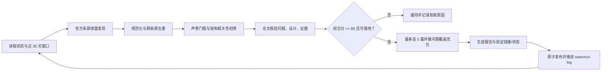

# Agent 服务器架构雷达

这是一个每 4 小时运行一次的增量研究闭环，关注“Agent 服务器应用如何可靠落地”，这里的“计算机架构”按服务端系统/软件架构理解，而不是 CPU 微架构。

## 当前结论

当前已完成 9 轮、收录 45 篇，最新报告见 [reports/2026-07-27/2026-07-27_09-21.md](reports/2026-07-27/2026-07-27_09-21.md)。可下载仓库后直接打开 [index.html](index.html)，按标题、故障、来源、轮次或主题离线检索全部文章。

雷达每轮只看运行时点之前 30 个自然日内首次公开或发生实质性更新的材料，目标是选出 5 篇；不足 5 篇时宁缺毋滥。每篇都必须回答：

1. 它解决了哪个可观察的生产故障？
2. 组件、协议或状态机如何解决这个故障？
3. 哪部分是来源事实，哪部分是本项目的工程推断？
4. 如何在 Agent 服务端采用？
5. 用什么测试、指标或不变量证明采用有效？

## 文件

- [CODEX_TASK.md](CODEX_TASK.md)：自动化每轮必须遵循的完整流程和质量门槛。
- `reports/YYYY-MM-DD/YYYY-MM-DD_HH-mm.md`：每轮独立中文报告。
- [index.md](index.md)：按时间倒序的报告索引。
- [state/item-cache.json](state/item-cache.json)：候选、评分、证据和发布状态的唯一事实源。
- [state/seen-items.json](state/seen-items.json)：跨轮去重索引。
- [state/run-log.jsonl](state/run-log.jsonl)：每轮搜索、筛选、发布和失败记录。

## 闭环

