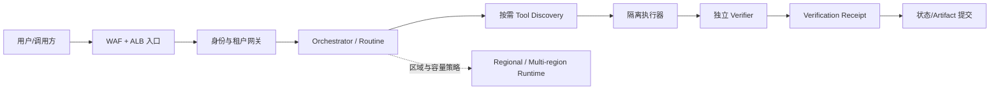

# Agent 服务器架构雷达｜2026-07-23 10:51

> 扫描窗口：2026-06-23 10:51 至 2026-07-23 10:51（Asia/Shanghai）  
> 结果：5 篇，1 篇研究预印本、4 篇官方工程博客；来源覆盖 UC Berkeley、AWS、Microsoft、Google。  
> 编辑判断：本轮最值得先采用的不是某个云产品，而是 **“执行成功必须由独立验证收据证明”**。它直接解决 Agent 自报成功、文件未生成或副作用不完整的问题。

## 五篇共同指向一套服务端骨架

| 优先级 | 生产问题 | 建议架构机制 | 来源 | 评分 |
|---:|---|---|---|---:|
| 1 | Agent 自报成功但结果不可复现 | executor/verifier 分离、隔离重放、verification receipt | UC Berkeley 预印本 | 94 |
| 2 | 多租户工具调用丢失用户身份或越权 | OBO token exchange、受众绑定、`sub`/actor 分离 | AWS 官方工程博客 | 92 |
| 3 | Agent 公网入口绕过 WAF，健康检查又被认证阻断 | WAF → ALB → PrivateLink，resource policy 封闭旁路 | AWS 官方工程博客 | 91 |
| 4 | 工具过多造成上下文膨胀和误选，定时任务缺少运行控制 | tool search/call 元工具、routine control plane、memory TTL | Microsoft Foundry 官方博客 | 88 |
| 5 | 全球服务的延迟、容量和数据驻留互相冲突 | regional/multi-region endpoint、预留吞吐、统一 IAM/观测 | Google Cloud 官方博客 | 86 |

建议把它们组合成：

## 1. RECEIPT：不要相信 Agent 的“我完成了”

**来源与时效。** [RECEIPT: Deterministic, Reward-Hacking-Resistant Verification for White-Box Agentic XSS Discovery](https://arxiv.org/abs/2607.18575)，2026-07-20 提交的 arXiv 预印本。作者包含 UC Berkeley 的 David Wagner；其 [Berkeley 官方主页](https://vcresearch.berkeley.edu/faculty/david-wagner) 显示他是 EECS 教授、Carl J. Penther Chair，并获 ACM SIGSAC Test-of-Time Award。它满足 R 类“知名研究机构/研究者”门槛，但**没有正式接收证据，不能称为同行评审论文**。

**针对的问题。** Agent 既执行任务又判断自己是否成功，会出现奖励投机或“自证正确”：声称漏洞存在、声称文件已生成、声称副作用已完成，但环境已经污染、证据不可重放或产物根本不存在。

**原设计。** 论文把执行和裁决拆开，使用环境隔离、PoC 约束、角色分离、verdict binding 和受约束的浏览器重放。作者报告在 95 个真实 Web 应用目标上发现 24 个此前未知 XSS，其中 12 个已获维护者确认；在其测试中没有放行假阳性。这里的数字是作者报告，不是本雷达独立复验。

**对 Agent 服务器的采用设计（工程推断）。** 每个 run 结束时不要直接写 `SUCCESS`。执行器先提交不可变 `result_manifest`，列出预期 artifact、内容哈希、工具副作用和 provenance；独立 verifier 在干净环境检查文件存在性/完整性、重放关键副作用并生成绑定 `run_id + manifest_hash + verifier_version` 的 `verification_receipt`。状态机只允许 `RUNNING → VERIFYING → SUCCEEDED`，没有有效 receipt 就 fail closed。

**验收不变量。** `run.status == SUCCEEDED ⇒ verification_receipt 存在且 receipt.manifest_hash == result_manifest.hash`。故障注入应覆盖：删除预期文件、篡改哈希、复用旧 receipt、执行器伪造成功、污染验证环境；五种情况都不得进入 `SUCCEEDED`。

**边界。** 原论文针对 XSS 验证，推广到通用 artifact/业务副作用是工程外推；需要为各类工具定义可重放或可对账的 verifier adapter。

## 2. OBO：让工具知道“谁委托谁做了什么”

**来源与时效。** AWS 官方高级技术博客 [Implement on-behalf-of token exchange for multi-tenant agents with Amazon Bedrock AgentCore Gateway](https://aws.amazon.com/blogs/machine-learning/implement-on-behalf-of-token-exchange-for-multi-tenant-agents-with-amazon-bedrock-agentcore-gateway/)，2026-07-13，含完整请求流、JWT claim 变化和参考实现说明，满足 E 类。

**针对的问题。** Agent 用自己的 service identity 调下游，会抹掉真实用户并迫使所有工具无条件信任 Agent；原样转发用户 token，又会因为受众不匹配造成 confused deputy。多租户、异步执行时两种做法都不能可靠审计和最小授权。

**原设计。** 网关按 RFC 8693 执行 OBO token exchange：保留原用户 `sub`，把 `aud` 改写并绑定到单一下游服务，缩减 scope，同时用 actor claim 记录代办方。Gateway 校验入站 token 并路由，Identity 按租户换票，下游 resource server 独立校验 issuer/audience/scope；数据按 `tenant#sub` 分区。

**对 Agent 服务器的采用设计（工程推断）。** 把 `principal_id`、`tenant_id`、`actor_agent_id`、`target_audience`、`delegation_chain` 做成不可丢失的 execution envelope。所有工具调用必须经过 identity/tool gateway 即时换票，Agent 进程不持有跨租户通用凭据。授权依据 `sub`，审计和限流同时记录 `sub + actor_agent_id`。

**验收不变量。** 一个发给租户 A API 的 token 在租户 B API 必须在业务代码运行前失败；每条有副作用的工具调用都能从审计记录还原 user、agent、tenant、audience。故障测试至少覆盖 wrong audience、过期 token、租户路由错配和缺失 actor。

**边界。** AWS 示例依赖具体 IdP 行为，文中也说明 Okta 的 `scp` 在 token exchange 中可能比真实用户权限更宽，需要额外 `authorized_scopes` claim。跨 IdP 实现必须逐家验证，不能只按协议名称假设等价。

## 3. WAF + PrivateLink：安全入口不能留下可绕过的第二扇门

**来源与时效。** AWS 官方高级技术博客 [Securing Amazon Bedrock AgentCore Runtime with AWS WAF](https://aws.amazon.com/blogs/machine-learning/securing-amazon-bedrock-agentcore-runtime-with-aws-waf/)，2026-07-08；文中给出两个端到端测试过的拓扑、认证方式和验证矩阵，满足 E 类。

**针对的问题。** 生产 Agent endpoint 需要 WAF、限流和审计，但 Runtime 对调用（包括健康检查）要求 SigV4/OAuth，普通 ALB 健康检查会失败；API Gateway 还可能叠加第二层认证。同时，如果公开 Runtime endpoint 仍可直连，攻击者可以绕过 WAF。

**原设计。** 共同入口是 `Client → WAF → ALB → VPC Endpoint → Agent Runtime`。无请求变换时优先让 ALB 直连 PrivateLink ENI，组件少且没有 Lambda 额外延迟；需要认证翻译、请求变换或自定义审计时再加入 Lambda proxy。最后用 resource policy 限制 `aws:SourceVpce`，封闭公开 endpoint 旁路。

**对 Agent 服务器的采用设计（工程推断）。** 把边缘安全和 Agent runtime 分成两个平面：边缘层只做 L7 防护、速率和认证透传，runtime 做会话与执行；默认选择直连私有 endpoint，只有明确需要协议/身份变换时才增加 proxy。所有公开路径必须汇聚到同一 policy enforcement point。

**验收不变量。** 经 WAF/ALB 的合法请求返回成功；直连 Runtime 公网地址即使凭据合法也必须被拒绝；无认证请求失败；错误认证类型失败。资源策略漂移扫描应持续验证不存在绕过入口。

**边界。** 这是 AWS 特定实现，但“安全控制点必须不可旁路”和“按是否需要变换决定是否增加代理跳数”可以迁移到其他云。作者给出的 Lambda 延迟是场景估计，迁移前需在本系统压测。

## 4. Microsoft Foundry：工具目录和执行目录要分开

**来源与时效。** Microsoft Foundry 官方博客 [What’s New in Microsoft Foundry | June 2026](https://devblogs.microsoft.com/foundry/whats-new-in-microsoft-foundry-june-2026/)，发布于 2026-07-07，作者为 Microsoft Foundry Developer Experience 高级项目经理，包含命令、API 示例和明确预览/GA 状态，满足 E 类。

**针对的问题。** 把数百个工具 schema 全部塞进每次模型调用会浪费 token、挤占上下文并提高相似工具误选率；另一个独立问题是定时/触发式 Agent 若自行拼接 scheduler、queue 和状态记录，会产生第二套运行控制与观测链。

**原设计。** Tool Search 只向模型暴露 `tool_search`/`call_tool` 元工具，在运行时按意图发现相关工具，同时允许固定关键工具。Routines 负责 schedule/trigger/on-demand 的排队、执行和跟踪；Memory 增加 procedural memory 与 TTL。博客明确说这些能力含 preview 项，不能当作全部稳定 GA。

**对 Agent 服务器的采用设计（工程推断）。** 永久 capability registry 只保存版本化工具元数据；每个 run 通过检索得到小型 working set，并记录候选、最终选择和版本。调度控制面生成稳定 `run_id` 和 idempotency key，执行面按至少一次投递设计副作用去重，不假设平台天然 exactly-once。记忆必须带 scope、TTL 和删除策略。

**验收不变量。** 每轮可见工具 schema 数和 token 占用有上限；离线测试集持续测 `top-k tool recall` 与 wrong-tool rate；重复投递同一 `run_id` 不产生第二次业务副作用；过期 memory 在 TTL 后不可检索。

**边界。** 这是一篇产品更新汇总，不是独立性能研究。它清楚暴露了设计方向和接口，但“200+ 工具”是适用场景说明，不是通用阈值；是否采用必须以本系统测得的检索召回率和额外延迟为准。

## 5. Google Cloud：先定义数据驻留和容量，再选运行时

**来源与时效。** Google Cloud 官方博客 [Claude at scale on Google Cloud: Frontier AI, built for enterprise production](https://cloud.google.com/blog/products/ai-machine-learning/claude-at-scale-on-google-cloud-frontier-ai-built-for-enterprise-production)，2026-07-14，作者来自 Google Cloud Partner Technical Architecture 与 Developer Relations，给出 endpoint、运行时和 Agent 互操作选择，满足 E 类。

**针对的问题。** 全球 Agent 服务同时追求低延迟、高可用、受监管数据驻留和峰值容量，若只做“一个全球 endpoint + 自动扩缩容”，故障域、驻留边界和配额争用会被隐藏。

**原设计。** 模型服务区分 global、regional 和 multi-region endpoint；预留吞吐用于关键负载，batch 用于离线任务。Agent 层按 `build/register → deploy to Agent Runtime、Cloud Run 或 GKE/GKE Agent Sandbox → A2A interoperate` 分层，并复用 IAM、VPC、Logging/Monitoring。

**对 Agent 服务器的采用设计（工程推断）。** 控制面根据 workload policy 选择执行位置：强驻留任务固定 regional，区域容灾且允许同一大区流动的任务用 multi-region，离线批任务进 batch queue，关键在线任务预留容量。Agent sandbox、普通容器和托管 runtime 必须共用身份、trace 和 artifact 协议，避免换运行时就丢失审计。

**验收不变量。** 每类任务的 endpoint 选择可由 policy 解释；驻留任务的日志、输入、输出和中间状态不离开允许区域；区域故障演练满足 RTO/RPO；容量压测下关键队列的 p95 延迟和拒绝率不被公共流量挤占。

**边界。** 这是 Google/Anthropic 联合产品叙事，没有独立基准证明各 endpoint 的延迟或故障恢复效果。应把它当作拓扑选择框架，而不是对具体 SLO 的保证。

## 本轮建议

先实现一条最小闭环：`run_id → result_manifest → independent verifier → verification_receipt → state commit`。它不依赖特定云，能最快消除“Agent 看起来结束了，但文件/副作用并未可靠完成”这类高损失故障。随后再把 OBO execution envelope 和不可旁路的入口接入同一 run/trace；工具搜索、区域化和容量治理属于规模上来后的第二阶段。

## 核验说明

- 五篇原始发布日期均落在滚动 30 天窗口内。
- 工程博客来自厂商官方域名，但其产品能力和案例属于厂商一手主张；本报告没有把它们写成独立第三方验证。
- RECEIPT 的作者、日期和摘要由 arXiv 核验，研究者声誉由 UC Berkeley 官方页面核验；没有发现正式接收证据，因此明确标为预印本。
- 本轮没有用聚合站、转载或普通更新时间作为入选证据。

