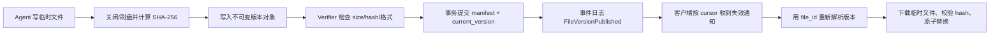

# Agent 文件真相与多客户端同步专项｜2026-07-23 11:07

> 扫描窗口：2026-06-23 11:07 至 2026-07-23 11:07（Asia/Shanghai）  
> 结果：5 篇，覆盖 W3C、APNIC、SeaweedFS 与 AWS。  
> 结论：这个 bug 的根因不是“文件同步慢”，而是系统把 **路径、链接、文件身份、文件版本和本地副本** 混成了一个概念。

## 推荐方向：服务器是真相源，本地只是可验证的物化副本

在“多客户端＋单服务器”前提下，不要一开始就做对等双向文件系统。最小正确模型是：

- `file_id`：稳定的逻辑身份，重命名、移动和产生新版本时不变。
- `version_id`：服务器分配的单调版本/对象 generation，表示“这是哪个版本”。
- `content_hash`：SHA-256，回答“字节是否相同”；相同 hash 不等于同一个逻辑文件。
- `storage_key`：指向不可变版本对象，不直接暴露给业务客户端。
- `current_version`：元数据服务中的可变指针，通过 CAS/`If-Match` 更新。
- `download_url`：短期传输能力，只绑定某个确定版本；客户端不能把它保存成永久业务链接。



最关键的 API 语义是：

```text
GET /files/{file_id}
→ { file_id, current_version, content_hash, size, state, resolver_url }

GET /files/{file_id}/versions/{version_id}
→ 不可变版本元数据 + 短期下载 URL

PUT /files/{file_id}/versions
If-Match: {base_version}
→ 新 version；过期客户端收到 412，不允许静默覆盖
```

## 五篇材料分别解决哪个缺口

| 材料 | 直接解决 | 采用要点 | 评分 |
|---|---|---|---:|
| SeaweedFS Conditional Writes | 多客户端并发写、旧版本覆盖新版本 | 预条件写、对象 owner 串行化、失败返回 412 | 94 |
| W3C WebAgents Interoperability Draft | 链接到底标识谁、变化如何订阅 | 资源 IRI、身份与表示分离、资源更新通知 | 92 |
| AWS S3 Zero-downtime Versioning | 版本切换和缓存旧 404/旧对象 | 唯一 version ID、分阶段迁移、避免错误缓存放大 | 91 |
| APNIC Data Synchronization | 服务器变化如何高效传播到多客户端 | snapshot+delta、push-notify/pull、Merkle 对账 | 90 |
| AWS AG-UI | Agent 服务端如何向多客户端发送状态变化 | 统一事件流、快照、双向状态；只做通知层 | 88 |

## 1. SeaweedFS：过期客户端不能靠“最后写入者获胜”

**来源与时效。** SeaweedFS 官方工程博客 [Conditional Writes Without a Compare-and-Swap Store](https://seaweedfs.com/blog/conditional-writes/)，2026-07-16，由 SeaweedFS Team 发布，给出组件分层、路由、锁、条件词汇和失败码，满足 E 类。

**针对的问题。** 多个客户端先读取同一个文件版本，再分别写回。若只是普通覆盖，后到的旧客户端会静默抹掉新内容；若先查再写但不是原子操作，两个写者仍可能同时通过检查。

**原设计。** 条件写把“检查前提＋写入”作为一个不可分事务。SeaweedFS 不要求所有底层元数据存储都支持 CAS，而是按对象 key 一致性哈希到唯一 owner filer；该 owner 用 per-path 本地锁串行化同一对象的写，检查 `If-Match`/`If-None-Match` 后再提交。不匹配返回 `412 Precondition Failed`。

**对 Agent 服务器的采用设计（工程推断）。** 单服务器不需要一致性哈希环，但应保留相同语义：所有 `file_id` 的版本提交经过一个 metadata transaction；客户端或 Agent 提交时携带 `base_version`。只有 `base_version == current_version` 才允许推进指针，否则返回 412，并保留双方版本供显式合并。

**验收不变量。** 两个客户端基于 `v7` 并发提交时，最多一个能把 current pointer 从 `v7` 推到新版本；另一个必须得到 412，且任何已提交不可变版本都不能被覆盖或丢失。

**边界。** SeaweedFS 的 owner routing 是集群内部实现；你的单服务器第一版只需数据库行锁或原子 CAS。不要过早复制一致性哈希和分布式 filer。

## 2. W3C：永久链接应标识资源，临时 URL 只负责传输

**来源与时效。** W3C WebAgents Community Group 的 [Report on Interoperability for Agents on the Web](https://w3c-cg.github.io/webagents/TaskForces/Interoperability/Reports/report-interoperability.html)，2026-07-17 Draft Community Group Report，编辑和作者来自 Inria、University of St. Gallen、UCD 等机构。它是**社区组草案，不是 W3C Recommendation**。

**针对的问题。** 当本地路径、云端对象 key、签名下载 URL 和业务链接都被称为“文件链接”时，任一层变化都会造成 link rot。客户端也无法判断一个 URL 是稳定身份、当前版本指针，还是即将过期的下载能力。

**原设计。** 报告强调 identifier 与 identity 的区别、用 IRI/URI 在上下文之外稳定标识资源、一个 IRI 只标识一个资源、资源语义变化时采用版本化 IRI，并要求可选择地监控资源更新。它还指出 MCP 的 `resources/subscribe` 与 `notifications/resources/updated` 需要能力协商且并非统一支持。

**对 Agent 服务器的采用设计（工程推断）。** 定义两类业务链接：`/files/{file_id}` 是稳定逻辑资源，解析到当前版本；`/files/{file_id}/versions/{version_id}` 是不可变版本资源。对象存储 signed URL 永远不进入数据库或消息正文，只在解析版本资源时临时生成。重命名只改 display path，不改变 `file_id`。

**验收不变量。** 对同一 `file_id`，重命名、移动、重新签发下载 URL都不改变逻辑链接；固定 version URL 在生命周期内始终返回同一 hash；一个 URL 不得在不同时间悄悄代表语义不同的逻辑文件。

**边界。** W3C 草案讨论的是开放多 Agent Web 互操作，不提供你的文件元数据 schema；这里采用的是其身份、版本化和资源监控原则。

## 3. AWS S3：先给每个对象版本一个身份证，再谈缓存

**来源与时效。** AWS Storage Blog [Zero-downtime Amazon S3 Versioning: Architectural patterns for mission-critical workloads](https://aws.amazon.com/blogs/storage/zero-downtime-amazon-s3-versioning-architectural-patterns-for-mission-critical-workloads/)，2026-07-01，包含 Vercel 生产案例、版本启用状态机和验证步骤，满足 E 类。

**针对的问题。** 对象更新期间的临时 404 或旧响应可能被边缘/客户端缓存；即使服务器随后正确，错误状态仍会长时间传播。没有 version ID 时，客户端也无法证明“本地文件对应云端哪个版本”。

**原设计。** S3 Versioning 为每个对象版本分配唯一 version ID。文章展示既有高流量 bucket 从 unversioned 经 `Suspended` 预传播，再切换到 `Enabled` 的阶段式迁移，并用 `HeadObject` 检查 `x-amz-version-id`，避免暂态 404 被 CDN 放大。

**对 Agent 服务器的采用设计（工程推断）。** 从第一天启用版本语义；元数据 manifest 同时保存 `file_id + version_id + content_hash`。缓存 key 必须包含 version ID；`/files/{file_id}` 的解析响应使用短 TTL/ETag，具体 version 下载使用长 TTL 和 immutable cache-control。404 也要区分“尚未发布”“已删除”“版本不存在”，不能统一长期缓存。

**验收不变量。** 客户端声称“已同步”时，本地记录的 `version_id` 与服务器 current version 相等，并且重新计算的 hash 与 manifest 相等。服务器 current pointer 变化后，旧 version URL仍可返回旧字节，但 stable resolver 必须返回新 version。

**边界。** 文章重点是启用 S3 Versioning 的迁移风险，不是完整客户端同步协议；Vercel 数据是厂商案例。你的核心设计不应依赖 S3，任何能提供不可变对象和版本 ID 的存储都可以。

## 4. APNIC：用通知减少延迟，用对账保证最终正确

**来源与时效。** APNIC 官方技术博客 Geoff Huston 的 [Data synchronization](https://blog.apnic.net/2026/07/13/data-synchronization/)，2026-07-13。文章比较全量覆盖、rsync、snapshot+delta、push、push-notify/pull、Merkle tree 及一致性模型，满足 E 类。

**针对的问题。** 只轮询会慢且浪费；只推送事件会因断线丢事件；每次传整个文件集会随客户端和数据规模失控。服务器变化后，本地一直停留在旧版本，本质上是“通知”和“对账”没有分层。

**原设计。** APNIC 将同步方法放在网络、计算、规模和一致性的权衡中：rsync 做块级差异；snapshot+delta 只传变化；push-notify/pull 用通知消除轮询不确定性；Merkle tree 适合大量数据和客户端的差异定位。单权威源和多主写入需要完全不同的一致性方案。

**对 Agent 服务器的采用设计（工程推断）。** 你的场景明确为单服务器权威源：正常路径用 `FileVersionPublished(file_id, version_id, hash, event_seq)` 通知，客户端收到后自行 pull；断线重连从 cursor 拉 delta。若 cursor 已过期或检测到序列缺口，拉取 workspace manifest snapshot；文件量很大后再增加 Merkle root 对账。

**验收不变量。** 丢弃、重复、乱序 10% 的通知后，每个在线客户端最终仍收敛到服务器 manifest；重复事件不重复写盘；发现 event gap 时必须进入对账而不是假定本地已最新。

**边界。** 文章是通用同步综述，不替你选择强一致或冲突策略。由于你的服务器是单一真相源，可以避免 P2P consensus；若未来允许离线本地编辑，必须另行定义冲突语义。

## 5. AG-UI：事件流是失效通知，不是文件内容真相源

**来源与时效。** AWS 官方高级技术博客 [Build generative UI for AI agents on Amazon Bedrock AgentCore with the AG-UI protocol](https://aws.amazon.com/blogs/machine-learning/build-generative-ui-for-ai-agents-on-amazon-bedrock-agentcore-with-the-ag-ui-protocol/)，2026-06-30，含参考代码、架构图、事件和双向状态示例，满足 E 类。

**针对的问题。** 多种 Agent runtime 各自输出不同流格式，前端难以统一处理状态更新；客户端断线或多个客户端观察同一 run 时，很容易把“看到某条完成消息”误当作“文件已生成并同步”。

**原设计。** AG-UI 以标准事件连接 Agent backend 和 frontend，支持 state snapshot、tool-call events、双向共享状态和 human-in-the-loop。AWS 示例把框架事件翻译为统一 AG-UI 流，并让前端解析器与具体 Agent 框架解耦。

**对 Agent 服务器的采用设计（工程推断）。** 在 AG-UI 或自有 SSE/WebSocket 流中只发送文件领域事件和版本引用，不发送本地路径或长期下载 URL：`ArtifactExpected`、`ArtifactVersionPublished`、`ArtifactVerificationFailed`、`ArtifactDeleted`。事件只触发客户端重新解析/拉取；真正判断文件是否存在和是否相同，仍查询 manifest 并校验 hash。

**验收不变量。** 收到 `ArtifactVersionPublished` 但下载/校验失败时，客户端不得显示“已同步”；断线重连必须先用 snapshot/cursor 补齐状态，再恢复增量流；两个客户端最终显示相同 `file_id/version_id/hash` 三元组。

**边界。** AG-UI 本身不定义文件版本、持久化或可靠消息语义，把它直接当文件同步协议会重现你的 bug。它只适合作为通知与交互适配层。

## 对第一个 bug 的最小修复切片

第一阶段只做以下五项，暂不做离线多主合并、CRDT 或完整虚拟文件系统：

1. 建 `files`、`file_versions`、`run_expected_artifacts` 三张元数据表。
2. Agent 只能写临时路径；服务端完成 hash/验证/manifest 提交后才发布版本。
3. 客户端永久保存 `file_id`，本地索引保存 `version_id + hash + local_path`；不保存 signed URL 作为业务链接。
4. 所有 current pointer 更新必须携带 `base_version`，过期写返回 412。
5. 建可重放的 artifact event log；实时通知负责快，manifest 对账负责正确。

建议状态机：

```text
EXPECTED → UPLOADING → VERIFYING → AVAILABLE
                    ↘ FAILED
AVAILABLE → SUPERSEDED | DELETED
```

Agent run 只有在所有 required artifact 都进入 `AVAILABLE` 且拥有 verification receipt 后才能 `SUCCEEDED`。这把“Agent 是否生成文件”“本地是否同一版本”“link 是否过期”拆成三个独立、可观测、可测试的问题。

## 核验说明

- 五篇均在滚动 30 天窗口内，且未在上一轮正式发布；AG-UI 是上一轮留存的 eligible 库存，本轮因专项相关性进入报告。
- W3C 材料明确标为 Community Group Draft，没有冒充正式标准。
- AWS 和 SeaweedFS 的实现/案例属于厂商或项目方一手陈述；报告中的通用数据模型与采用步骤是工程推断。
- 2026-06-08 的 AWS 持久 workspace 文章与 2026-02 的 FAST SkySync 论文虽高度相关，但超出 30 天窗口，因此没有计入本轮五篇。

