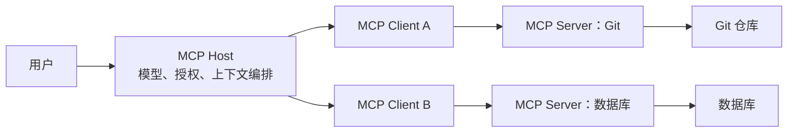
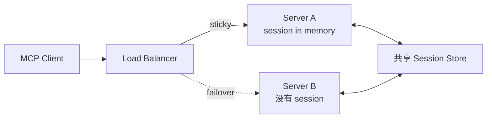
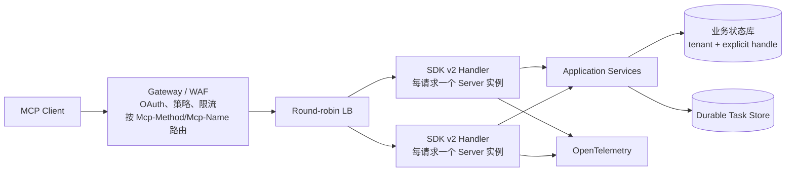
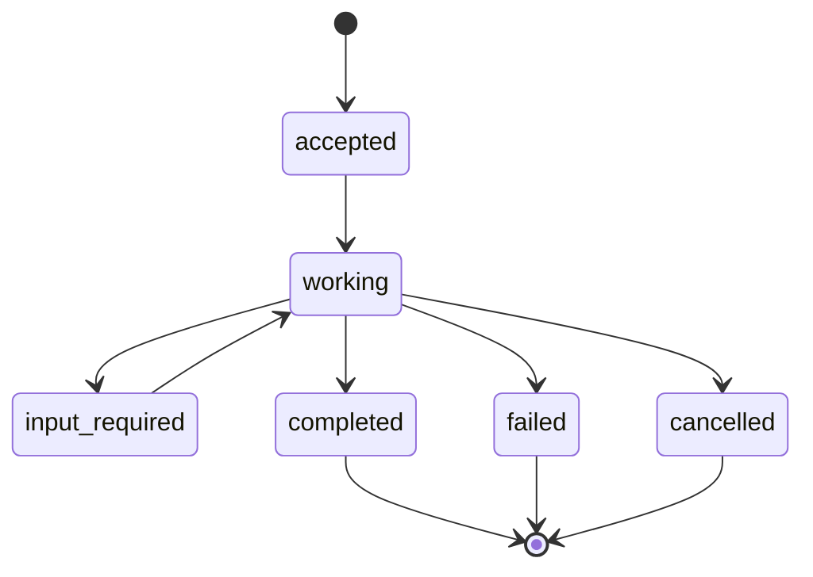

# MCP Server 从 SDK v1 到 v2：10 篇一手博客串起旧设计、生产陷阱与无状态未来

> 调研时间：2026-07-30；范围：10 篇 MCP 官方、Anthropic、Cloudflare、Microsoft、AWS 的一手工程博客，辅以正式规范、迁移文档和已发布 SDK 实现核验。

## 先纠正一个关键叫法

**MCP 规范没有正式的“协议 1.0 / 协议 2.0”名称。** MCP 规范用日期标识版本，例如 `2025-11-25` 与 `2026-07-28`。你看到的 v1/v2 主要是 TypeScript SDK 的包代际：

- SDK v1：`@modelcontextprotocol/sdk@1.x`，覆盖旧的 stateful lifecycle、`initialize`、`Mcp-Session-Id`、GET/SSE 与服务端主动请求等机制。
- SDK v2：拆成 `@modelcontextprotocol/server@2.x` 和 `@modelcontextprotocol/client@2.x`，实现 `2026-07-28` 的 stateless core。
- 服务器自身写在 `new McpServer({ version: "1.0.0" })` 里的 version 是**你的 Server 应用版本**，也不是 MCP 协议版本。

因此本文为了方便，把 **“旧代”** 指 `2025-11-25` 及 SDK v1 的会话型设计，把 **“新代”** 指 `2026-07-28` 及 SDK v2 的无会话核心；不会把它们伪装成官方协议名称。

## 一句话结论

旧设计的核心是：**Host 管安全边界，每个 Client 与一个 Server 建立有状态连接，通过初始化协商能力，并在同一双向通道上使用 Tools、Resources、Prompts、Sampling、Elicitation 和通知。**

新设计的核心是：**MCP 传输层只负责自描述、可路由、可缓存、可观测的独立请求；业务状态通过显式 handle 或 Task 管理，人机多轮交互通过 MRTR 重放，扩展能力独立协商。**

最重要的思想变化不是“把 session 删了”，而是：

> **Agent 应用可以有状态，但协议连接不应偷偷成为业务状态的所有者。**

## 10 篇主线博客

| 序号 | 时间 | 一手来源 | 它在演化链中的位置 |
|---:|---|---|---|
| 1 | 2024-11-25 | [Anthropic：Introducing the Model Context Protocol](https://www.anthropic.com/news/model-context-protocol) | 原始目标：用统一协议替代 N×M 数据源集成 |
| 2 | 2025-03-25 | [Cloudflare：Build and deploy Remote MCP servers](https://blog.cloudflare.com/remote-model-context-protocol-servers-mcp/) | 从本地 stdio 走向远程 HTTP、OAuth 与多用户 |
| 3 | 2025-08-22 | [MCP Maintainers：Evolving OAuth Client Registration](https://blog.modelcontextprotocol.io/posts/client_registration/) | 揭示 DCR 在开放 MCP 生态中的注册爆炸与冒充问题 |
| 4 | 2025-11-25 | [MCP Maintainers：One Year of MCP / November Spec](https://blog.modelcontextprotocol.io/posts/2025-11-25-first-mcp-anniversary/) | 旧代功能峰值：Tasks、企业授权扩展、URL elicitation |
| 5 | 2025-12-19 | [Transport WG：Exploring the Future of MCP Transports](https://blog.modelcontextprotocol.io/posts/2025-12-19-mcp-transport-future/) | 正式承认 stateful transport 在生产扩缩容上的结构性问题 |
| 6 | 2026-02-11 | [Microsoft：How we built the Microsoft Learn MCP Server](https://devblogs.microsoft.com/engineering-at-microsoft/how-we-built-the-microsoft-learn-mcp-server/) | 真实公共 Server 的工具契约、兼容性和数据驱动运营经验 |
| 7 | 2026-04-14 | [AWS：Deploying MCP servers on Amazon ECS](https://aws.amazon.com/blogs/containers/deploying-model-context-protocol-mcp-servers-on-amazon-ecs/) | 已实现的容器化、私网、stateless Streamable HTTP 参考架构 |
| 8 | 2026-06-01 | [AWS：Extending MCP support for AgentCore Gateway](https://aws.amazon.com/blogs/machine-learning/extending-mcp-support-for-amazon-bedrock-agentcore-gateway-2/) | 已实现的 Gateway、动态目录、会话映射、OBO 与 elicitation |
| 9 | 2026-06-29 | [MCP Maintainers：Beta SDKs for 2026-07-28](https://blog.modelcontextprotocol.io/posts/sdk-betas-2026-07-28/) | 新协议从提案进入 TypeScript/Python SDK 可运行阶段 |
| 10 | 2026-07-28 | [MCP Maintainers：The 2026-07-28 Specification](https://blog.modelcontextprotocol.io/posts/2026-07-28/) | 新代正式发布：stateless、MRTR、header routing、cache hints |

已实现性补充证据：[Cloudflare Agents SDK v0.20.0](https://developers.cloudflare.com/changelog/post/2026-07-27-agents-sdk-v0.20.0-mcp-sdk-v2/) 已同时实现 SDK v2 server/client、`server/discover` 探测、MRTR 和双通道迁移；[Cloudflare v1→v2 迁移指南](https://developers.cloudflare.com/agents/model-context-protocol/guides/migrate-to-mcp-sdk-v2/) 给出了可运行代码、限制和上线顺序。

---

## 第一部分：旧设计到底是什么

### 1. Anthropic 的原始设计：连接标准，而不是 Agent Runtime

第一篇博客解决的是集成爆炸：如果有 N 个 AI Host 和 M 个数据/工具系统，私有适配会趋向 N×M。MCP 把它变成 Host 实现 Client、外部系统实现 Server，双方只对一套协议。

原始边界可以这样理解：



这里有四个至今仍正确的核心：

1. **Host 是最终安全主体。** Host 决定连谁、给模型看什么、是否需要用户批准；Server 不能因为会说 MCP 就自动可信。
2. **Client 与 Server 一对一隔离。** 一个 Server 的能力、通知、内容不应直接污染另一个连接。
3. **Server 专注领域能力。** 不把模型、Agent 循环、用户会话和所有外部系统全塞进一个“大 MCP Server”。
4. **协议传上下文与能力，不替代业务 API。** MCP Server 通常仍然调用真实数据库、SaaS API 或内部服务。

早期博客强调的是 Tools/Resources/Data Source 的通用连接，远程多租户、企业 OAuth、水平扩容和长任务还没有成为设计中心。

### 2. 三个 Server Primitive 的真正区别

旧代与新代都保留了 Server 的三类核心 primitive：

| Primitive | 谁控制使用时机 | 正确用途 | 常见误用 |
|---|---|---|---|
| Tool | 模型/Host 决定调用 | 有计算或副作用的动作、带参数查询 | 把所有文档都做成上百个 Tool |
| Resource | 应用/Host 决定读取与注入 | URI 标识的文件、记录、schema、制品 | 返回无版本、无权限边界的巨大文本 |
| Prompt | 用户/应用显式选择 | 可复用工作流模板与少样例 | 用 Prompt 偷偷授予工具权限 |

`tools/list`、`resources/list/read`、`prompts/list/get` 是发现与使用契约。Server 必须把 schema、错误和 provenance 做好；MCP 只让能力“可发现”，不会自动让模型正确选择。

### 3. 旧生命周期：能力在连接开始时冻结

旧代远程 MCP 的典型调用是：

```text
initialize
  -> 返回 protocolVersion、serverInfo、capabilities
initialized
  -> tools/list
  -> tools/call + Mcp-Session-Id
  -> 服务器可能通过 SSE 推送通知或反向请求
```

其设计动机是合理的：

- 一次协商，后续消息较小；
- 双向连接适合 server-to-client sampling、elicitation、roots 和通知；
- `Mcp-Session-Id` 可以把连接范围的状态与一组请求关联；
- SSE 可以推送进度、目录变化和服务端请求；
- 本地 stdio 的进程生命周期天然就是 session。

问题是，**连接状态、协议能力、用户上下文和业务状态逐渐绑在了一起**。

### 4. Cloudflare 的远程化：OAuth 成为必需组件

Cloudflare 的 2025 博客是本地 MCP 到生产 MCP 的第一个重要转折。stdio Server 运行在用户机器上，通常继承本机权限；远程 Server 面向互联网与多个用户，必须解决：

- 谁在连接；
- 用户允许 Client 访问哪些资源；
- Server 如何代表用户调用上游服务；
- 浏览器、桌面和移动 Client 的 callback 如何工作；
- token、client registration 和 consent 如何管理。

Cloudflare 当时的实现让 MCP Server 同时扮演：

- 对 MCP Client 来说的 OAuth Resource/Authorization Server；
- 对 GitHub、Google 等上游来说的 OAuth Client；
- 将上游身份映射为 MCP 侧 scope 的策略层。

这一步很关键，但也暴露出一个坑：**认证成功不等于工具授权正确**。生产 Server 必须对每个 Tool、Resource 和参数重新做 tenant/user/scope 检查，不能只在 `/authorize` 入口检查一次。

### 5. OAuth DCR 的结构性问题

MCP 的连接模式与传统 SaaS OAuth 不同：用户可以把任意 Client URL 连接到任意 Server，Client 与 Authorization Server 往往没有预注册关系。早期使用 Dynamic Client Registration（DCR），很快出现：

- 每个 Client×设备×Authorization Server 产生注册记录，数据库无界增长；
- client ID 的失效、更新和跨设备复用语义不清；
- 开放 `/register` 是匿名写入口；
- consent 页上的 Client 名称可能被冒充；
- 企业 IdP 通常不愿打开 DCR，团队被迫再造 OAuth proxy。

后续方案 Client ID Metadata Document（CIMD）让 `client_id` 直接成为 HTTPS metadata URL。Authorization Server 按需读取、校验并缓存 metadata，不为每个用户写注册记录。它解决运维扩张，但**不自动证明桌面二进制未被篡改**；Client 身份可信与注册存储是两个不同问题。

---

## 第二部分：旧设计在生产里踩了什么坑

### 6. Session 把水平扩容变成分布式状态问题

旧代协议一旦返回 `Mcp-Session-Id`，后续请求就必须带上它。多实例部署只有两个选择：



- sticky session：简单，但实例故障、扩缩容、长尾和热点不均衡；
- shared session store：可故障转移，但把每次 tool call 变成分布式状态读取，并引入版本、锁、过期、重放和清理。

Transport WG 总结的四个主要问题是：

1. 网关必须解析 JSON-RPC body 才知道 `tools/call` 和 tool name，普通 header 路由失效；
2. session affinity 阻碍 round-robin 与 serverless；
3. 简单、无状态 Tool 也被迫承担 session 基础设施；
4. 一个 session 到底代表 HTTP 连接、MCP Client、用户对话还是业务工作流，没有统一答案。

最危险的实现是把数据库事务、浏览器实例、购物篮或审批流程只挂在 `Mcp-Session-Id` 下。协议 session 过期后，业务状态就失去可寻址性；重试到另一实例又可能重复执行副作用。

### 7. SSE 同时承担太多职责

旧 HTTP+SSE / Streamable HTTP 设计里，SSE 可能同时承载：

- 一个长 Tool 的 progress/result；
- Server 主动发起的 elicitation 或 sampling；
- tools/resources/prompts 变化通知；
- 连接恢复和 `Last-Event-ID` replay。

这会引出：

- 代理、网关和 LB 的 idle timeout；
- 断线后不知道 Tool 是否执行成功；
- replay 导致重复交付，但副作用没有幂等键；
- GET stream 与 POST response stream 的消息归属模糊；
- server-to-client 请求要求实例继续保存 pending request；
- 一个慢 Client 消耗连接、内存与 backpressure budget。

SSE 本身没有错，错误是让一条隐式长连接成为业务可靠性的唯一载体。

### 8. Tool 目录动态，但 Client 常常把它当静态 API

Microsoft Learn MCP Server 的生产经验非常具体：

- Tool description 就是“给模型看的用户手册”，小的措辞变化会显著改变激活率；
- `search -> fetch` 两个 Tool 的组合需要在描述中教给 Agent；
- 即使有 `tools/list`，仍有 Client 把 schema 硬编码；
- 参数从 `question` 改为 `query` 后，仍有 2%–5% 请求失败，必须同时接受旧字段并设置 deprecation window；
- Client 通常只在 session refresh 时重新发现目录。

因此 MCP schema 不是随手改的 prompt 文本，而是**模型消费的公共 API contract**。至少需要：

- additive-first 演化；
- 参数 alias 和弃用窗口；
- tool catalog version；
- description 行为回归测试；
- 输入/输出 schema 验证；
- 对 destructive、read-only、idempotent 等 annotation 不盲目信任。

### 9. 长任务一度被塞进 Core，但生命周期仍不成熟

`2025-11-25` 引入实验性 Tasks，把长任务建模为 `working / input_required / completed / failed / cancelled`，支持 polling 和结果保留。这解决了 Tool 调用几分钟到几小时、Client 不能一直等的问题。

但旧版 Task 仍与 session 边界强耦合：

- `tasks/list` 在没有明确用户/租户范围时容易泄露别人的任务；
- session 断开后谁能继续读取、取消任务不够清楚；
- transient retry、结果保留和幂等创建仍需业务层定义；
- SSE 与 polling 并存，消息可能出现在不同 stream；
- Client 发起 task 还是 Server 决定异步化，职责不稳定。

这些生产反馈最终让 Tasks 从实验性 Core 移到独立 extension，并删除不安全的全量 list。

### 10. “网关缓存 Tool 目录”会造成权限和新鲜度陷阱

AgentCore Gateway 展示了两种已实现模式：

- default listing：Gateway 预取并缓存各 Server 的 capability，能做统一语义搜索，延迟低；
- dynamic listing：按当前用户身份实时转发 `tools/list`，能得到用户专属目录，但不能使用 Gateway 的预索引语义搜索。

坑在于 `tools/list` 往往同时受以下因素影响：

- tenant；
- user/role/scope；
- feature flag；
- Server release；
- 上游资源状态。

若缓存 key 只有 Server URL，就可能把管理员 Tool 暴露给普通用户。旧协议只有 list-changed hint，没有明确 TTL 与共享范围；这正是新代加入 `ttlMs` 和 `cacheScope` 的原因。

---

## 第三部分：未来设计已经怎样落地

### 11. 新代最核心的变化：协议无状态，业务状态显式化

`2026-07-28` 正式删除：

- `initialize / initialized`；
- `Mcp-Session-Id`；
- 协议层 session。

每个请求自带：

- `MCP-Protocol-Version`；
- `_meta` 中的 Client identity/capability；
- `Mcp-Method`；
- 对 Tool/Prompt/Resource 操作的 `Mcp-Name`。

Client 需要预热 UI 或目录时可调用可选的 `server/discover`，但普通 Client 可以直接乐观调用并处理“不支持”错误。

新的部署形态：



业务如果确实有状态，Tool 返回显式、受权限保护的 handle：

```text
create_browser() -> { browser_id: "br_123" }
navigate({ browser_id: "br_123", url: ... })
close_browser({ browser_id: "br_123" })
```

handle 必须绑定 tenant/principal、权限、TTL 与资源版本；它不应是可猜测数据库主键。模型能看见并传递它，服务端能审计它，重试也不依赖某台实例的内存。

### 12. MRTR：把“服务器反向找客户端”改为可重放协议

旧代 Server 在 SSE 上发 `elicitation/create`，并保存 pending call。新代返回：

```json
{
  "resultType": "input_required",
  "inputRequests": {
    "confirm": {
      "type": "elicitation",
      "message": "确认删除 3 个文件？",
      "schema": { "type": "boolean" }
    }
  },
  "requestState": "opaque-and-integrity-protected"
}
```

Client 收集输入，再用 `inputResponses` 与最新 `requestState` 重试原操作。任一实例都能继续。

`requestState` 不是可信 cookie，Server 应：

- 签名/加密；
- 绑定 user、tenant、原 method、tool name 和参数 hash；
- 设置短 TTL；
- 防重放或为副作用配置幂等键；
- 不把 secret 放入客户端可读明文；
- 每轮只信任最新 state，不能假设 Client 会累积所有历史 answer。

### 13. Header-based routing 让 MCP 真正进入普通网关

`Mcp-Method` 与 `Mcp-Name` 使 WAF、Gateway、LB 不解析 JSON-RPC body 也能：

- 对 `tools/call` 与 `resources/read` 分别限流；
- 对 destructive Tool 强制审批；
- 把读 Tool 路由到只读池；
- 为高成本 Tool 配独立 concurrency budget；
- 在网关层生成低基数指标；
- 做按 tenant/tool 的熔断。

Server 必须校验 header 与 JSON body 一致，否则攻击者可以让 Gateway 看到 `read`，而 body 实际调用 `delete`。

### 14. Cache hint 把“目录什么时候过期”变成契约

新代 `tools/list`、`prompts/list`、`resources/list/read` 返回 `ttlMs` 与 `cacheScope`。这比旧的 list-changed notification 更适合无状态系统。

推荐缓存 key：

```text
(server_id, protocol_version, tenant, principal_policy_hash,
 catalog_release, method, normalized_params)
```

`cacheScope` 决定能否跨用户共享，`ttlMs` 只是最长新鲜期，不覆盖主动撤权。权限或高风险 Tool 变化时仍应：

- 提升 policy/catalog epoch；
- 让 Gateway 在 epoch 不匹配时 miss；
- 对紧急撤权采用 deny list 或 policy check；
- 不仅依赖 TTL 等自然过期。

### 15. Task 从连接状态升级为业务实体

新 Tasks extension 的方向是：

- Server 决定某次 `tools/call` 是否返回 task handle；
- Client 用 `tasks/get / update / cancel` 驱动；
- Task 有明确 principal、状态机、结果 TTL 和并发控制；
- 删除无法安全定界的 `tasks/list`；
- 连接断开不影响 Task；
- Task effect 用幂等键和 receipt 独立验证。

建议状态机：



`completed/failed/cancelled` 必须终态不可逆。Client 超时不等于 Task 失败；Tool HTTP request 失败也不等于副作用没发生。

### 16. Extension Framework：核心协议不再无限膨胀

新代把复杂能力移到独立 extension：

- reverse-DNS extension ID；
- Client/Server 在 capabilities map 中显式协商；
- extension 独立版本；
- 不认识 extension 的一方跳过，core 继续工作；
- 实验能力有独立仓库、维护者与成熟路径。

MCP Apps、Tasks、Enterprise-Managed Authorization 已按此思路推进。对 Server 开发者的含义是：**不要为了一个私有功能偷偷改变 core method/schema**。用扩展命名空间或普通 Tool 建模，并为没有扩展的 Client 提供清晰降级。

### 17. Authorization 新设计

新代安全变化包括：

- Client 校验授权响应中的 `iss`，防 authorization-server mix-up；
- token/client credential 与 issuer 绑定，不能跨 Authorization Server 复用；
- DCR 进入弃用，方向转向 CIMD；
- desktop/CLI 通过 `application_type` 避免 localhost redirect 被误判为 web client；
- 企业可用 EMA 一次登录、中央 IdP 策略；
- Gateway 可用 OAuth OBO，把 `aud=gateway` 的用户 token 换成 `aud=mcp-server` 的下游 token。

正确身份链应该始终保留：

```text
human principal
  -> MCP client identity
  -> gateway audience token
  -> target-server audience token
  -> downstream API credential
  -> effect receipt
```

每一跳都应 audience-bound、scope-down、可审计；Server 不应把上游用户 token 原样转发给任意下游。

---

## 第四部分：两个已实现架构告诉我们什么

### 18. AWS ECS：简单 Server 应优先 stateless

AWS 的参考实现把 UI、Agent 和 FastMCP Server 分成三个 ECS/Fargate service：

- 只有 UI 通过 ALB 暴露公网；
- Agent 与 MCP Server 位于 VPC 私网；
- Service Connect/Cloud Map/Envoy 做服务发现；
- MCP Server 用 stateless Streamable HTTP；
- S3 是领域数据源；
- IAM task role、SigV4、CloudTrail 和容器沙箱负责真实权限与审计。

这是很好的“Server 是领域适配器”范式。它没有为了 MCP 自建一个复杂 session plane，每次 Tool call 是自包含请求，因此能普通水平扩容。

### 19. AgentCore Gateway：复杂 Server 需要显式控制面

AgentCore Gateway 展示了旧代生产折中：

- 中央 Gateway 聚合多个 MCP Server；
- 静态/动态 Tool listing；
- 统一 OAuth、credential、策略、审计；
- Streamable HTTP + SSE；
- Gateway 用 durable store 保存 client session 到 target session 的映射；
- downstream session 失效后透明重新 initialize；
- elicitation 依赖 session management；
- OBO 保留终端用户身份。

它证明 stateful MCP 不是不能做，而是代价集中到了 Gateway：session ownership、映射、过期、重新协商、缓存一致性和多租户过滤都必须由控制面承担。迁到新代后，Gateway 仍有价值，但可以删掉**协议 session 映射**，只保留业务 Task、显式 handle、身份与策略状态。

### 20. Cloudflare：SDK v2 已经给出双通道迁移

Cloudflare Agents SDK v0.20.0 已实现：

- `@modelcontextprotocol/server@2.0.0`；
- 每个请求调用 factory 创建独立 `McpServer`；
- Client 先用 `server/discover` 探测新代，不支持则回退旧 `initialize`；
- stateless MRTR；
- issuer-bound OAuth credential；
- 同一 URL 同时服务 stateless 与 legacy lane；
- legacy sessionful 功能迁完、旧 session 排空后删除旧 lane。

这说明新设计不是路线图幻灯片，而是已有官方 SDK 与云边缘 runtime 可运行。

---

## 第五部分：我建议你怎样构造一个新 MCP Server

### 21. 推荐模块边界

| 模块 | 责任 | 不应该拥有 |
|---|---|---|
| Edge/Gateway | TLS、Host/Origin、OAuth、header/body 一致性、WAF、限流 | Tool 业务状态 |
| Protocol Adapter | SDK v2、schema decode、`server/discover`、MRTR | 租户数据库事务 |
| Catalog | Tool/Resource/Prompt 定义、版本、TTL、cache scope | 用户 access token |
| Policy | principal×tenant×tool×argument 决策 | 模型自然语言判断 |
| Tool Service | 领域逻辑、幂等、副作用 receipt | MCP transport session |
| Handle Store | browser/cart/workspace 等显式状态 | 连接级能力协商 |
| Task Service | 长任务状态机、取消、结果保留 | SSE 连接生命周期 |
| Artifact Store | 大结果、日志、文件、hash、下载授权 | 无边界 base64 prompt |
| Observability | W3C trace、metrics、audit、cost | 业务授权决策 |

### 22. Tool contract 设计清单

每个 Tool 至少应定义：

- 稳定名称，避免带部署版本；
- 清晰、可评测的 description；
- 完整 JSON Schema 2020-12 输入；
- `additionalProperties: false` 或明确扩展策略；
- output schema 与 structured content；
- read-only / destructive / idempotent / external effect 的风险信息；
- tenant 与 principal 的授权位置；
- timeout、retry class、idempotency key；
- effect receipt；
- 错误分类：协议错误与可被模型修正的业务错误分开；
- 兼容期：参数 alias、默认值与弃用日期。

不要把 15,000 个底层 API 直接变成 15,000 个 Tool。可以采用：

- 少量高价值领域 Tool；
- `search -> fetch/execute` 两阶段；
- 动态目录与权限过滤；
- Code Mode/脚本沙箱把多次低层调用合为一次受控执行；
- Skill/Prompt 提供使用说明，但不让说明文本授予权限。

### 23. 最小生产请求流

```text
1. Gateway 验证 Host、Origin、OAuth issuer/audience、tenant。
2. 校验 Mcp-Method/Mcp-Name 与 JSON-RPC body 一致。
3. Policy 以 principal + tool + normalized args 做授权。
4. Protocol Adapter 校验 JSON Schema、deadline、request size。
5. Tool Service 以 idempotency key 执行业务。
6. 产生 result 或 task/handle/effect receipt。
7. 输出结构化结果，附 trace 与 artifact reference。
8. Audit 记录“谁以什么权限对哪个对象产生了什么效果”。
```

### 24. 必须验证的不变量

- 任意两个相同幂等键的 mutating call 最多产生一次业务副作用。
- 任一请求落到任一实例结果一致，不依赖前一请求落在哪台机器。
- handle 不能跨 tenant/principal 使用，过期后 fail closed。
- `Mcp-Method/Mcp-Name` 与 body 不一致时必须拒绝。
- Tool 目录缓存不能跨 `cacheScope`；撤权不等待普通 TTL。
- MRTR `requestState` 被篡改、跨用户复用或过期时必须拒绝。
- Task 终态不可逆；Client 断线不能把 working 自动判为 failed。
- OAuth credential 必须 issuer/audience-bound，不得在目标 Server 之间横向复用。
- Tool schema 变更必须通过旧 Client contract test 和模型行为回归。
- Server 重启、LB 换实例、Gateway 超时和 SSE 断流均不能产生未知的重复副作用。

---

## 第六部分：SDK v1 → v2 迁移方案

### 25. 先按依赖分类，而不是直接升级包

可以直接迁移到 v2 的 Server：

- 只有普通 tools/resources/prompts；
- 没有协议 session 状态；
- 没有 transport event replay；
- 没有 standalone GET stream；
- 没有 pushed elicitation/sampling/roots；
- 没有靠 HTTP DELETE 清理 session。

需要双通道的 Server：

- 业务状态以 `Mcp-Session-Id` 为 key；
- 使用 `McpAgent` / Durable Object 保存 protocol session；
- 依赖 server-to-client 主动请求；
- 依赖 SSE replay 或独立 notification stream；
- 活跃 Client 只理解旧 initialize。

### 26. 功能替换表

| SDK v1 / 旧代依赖 | SDK v2 / 新代替代 |
|---|---|
| `initialize` capability handshake | 每请求 `_meta`；需要时 `server/discover` |
| `Mcp-Session-Id` | 业务 Tool 返回显式 handle |
| Session 内业务状态 | tenant/principal-bound application store |
| pushed elicitation/sampling | `input_required` + MRTR |
| GET SSE list-change stream | `subscriptions/listen`，断线重开 |
| `Last-Event-ID` transport replay | 请求独立可恢复；业务进度放 Task store |
| 实验性 core Tasks | `io.modelcontextprotocol/tasks` extension |
| DCR | CIMD；兼容期内双支持 |
| transport logging | OpenTelemetry / stderr |
| deep JSON body routing | `Mcp-Method` / `Mcp-Name` headers |

### 27. 安全上线顺序

1. 冻结当前 Tool contract，并采集旧 Client/feature 使用率。
2. 把 session 内业务状态迁为显式 handle/Task，不先改外部协议。
3. 新建 SDK v2 factory；保证每个请求独立 Server 实例。
4. 在同一 URL 部署 v2 stateless lane 与 v1 legacy lane。
5. Client 用 `server/discover`，失败才走 `initialize`。
6. 对两条 lane 做 shadow/contract comparison，尤其验证副作用幂等。
7. 先迁普通 Tool，再迁 MRTR、subscription、Task。
8. 等旧 session 自然 drain；监控 legacy 请求降到零。
9. 删除 v1 route 与仅为 protocol session 存在的共享状态。
10. 最后再拆包、删旧 SDK 依赖和 Durable Object binding。

不要在发布 v2 route 的同一变更里直接删除 session store；回滚时可能找不到仍在运行的旧 session。

## 最终判断

早期 MCP 的设计核心不是错，它极好地解决了“让模型以统一方式发现并调用外部能力”，并且 host/client/server、Tools/Resources/Prompts、JSON-RPC 与渐进 capability 这些边界全部保留下来了。

真正需要替换的是**把连接当工作流、把 transport session 当业务状态、把 SSE 当可靠队列**的隐式状态架构。

2026-07-28 与 SDK v2 的未来设计已经落地，其工程方向很清楚：

- 协议无状态；
- 业务状态显式；
- 长任务耐久化；
- 多轮输入可重放；
- 目录有缓存契约；
- 网关可按 header 治理；
- 身份逐跳收窄；
- 高级能力用 extension 演进；
- 旧新协议双通道迁移。

如果现在从零构造 MCP Server，应默认选 SDK v2/stateless core；只有明确存在长任务、浏览器实例、工作区或审批流程时才引入状态，而且状态必须属于对应的应用实体，不属于 MCP 连接。

## 辅助规范与实现

- [旧代架构说明（2025-06-18）](https://modelcontextprotocol.io/specification/2025-06-18/architecture)
- [旧代 Streamable HTTP 与 Session（2025-11-25）](https://modelcontextprotocol.io/specification/2025-11-25/basic/transports)
- [Tools 规范与安全要求](https://modelcontextprotocol.io/specification/2025-11-25/server/tools)
- [2026-07-28 正式发布博客](https://blog.modelcontextprotocol.io/posts/2026-07-28/)
- [Cloudflare SDK v2 迁移指南](https://developers.cloudflare.com/agents/model-context-protocol/guides/migrate-to-mcp-sdk-v2/)
- [Cloudflare v0.20.0 首日实现](https://developers.cloudflare.com/changelog/post/2026-07-27-agents-sdk-v0.20.0-mcp-sdk-v2/)
